# I. Clustering k-means
## 1) Implémentation de l'algo 
- Le cours propose un algorithme idéal dans lequel la condition de fin est l'égalité entre les 
  centroïdes entre deux itérations. Cette approche peut poser problème si l'on a un grand nombre 
  de points, car l'algorithme peut effectuer un grand nombre d'itérations pour un changement 
  ayant peu d'impact sur le résultat final.
- C'est pourquoi l'on propose une fonction remplaçant cette condition par deux paramètres _
  (nombre max d'itérations, tolérance de convergence)_ pour arrêter l'algorithme avec des résultats
  satisfaisants au niveau des résultats comme des performances.
## 2) Test sur des datasets
### Centroïdes initiaux $[[2], [6]]$

### Centroïdes initiaux $[[12], [24]]$
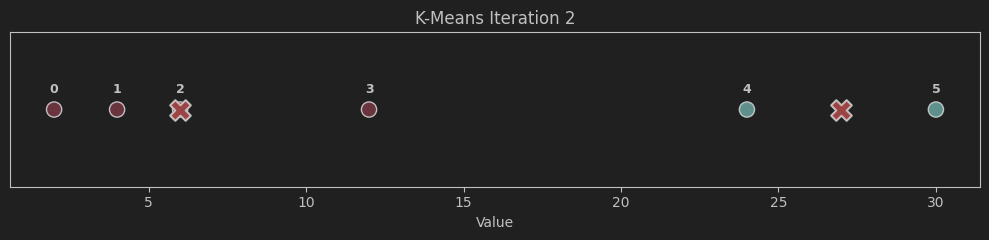

> On remarque que changer les centroïdes initiaux n'a pas eu d'influence sur le résultat final 
> pour cet exemple. Cependant le nombre d'itérations est plus faible pour le second cas.
> - La fonction objectif de l'algorithme étant non convexe, on peut cependant atteindre des 
minimum locaux dans certains cas. Les centoïdes initiaux ont donc bien une influence sur 
    les clusters finaux.
> - On suppose que ce n'est pas le cas ici car la séparation entre les deux clusters est assez 
  importante, de plus il y a peu de points ce qui limite le nombre de résultats possibles.

## 3) Features de visualisation
On ajoute une fonction pour visualiser les clusters à chaque itération. On crée à cet effet un 
fichier spécifique pour ne pas gêner la compréhension de la partie fondamentale du code.

On utilise la librairie `seaborn`, une surcouche de `matplotlib`.

On teste ensuite l'algo sur un dataset à deux colonnes. Comme vu ci-après on obtient les mêmes 
résultats que dans le sujet.

### Centroïdes initiaux $M_1$ et $M_2$

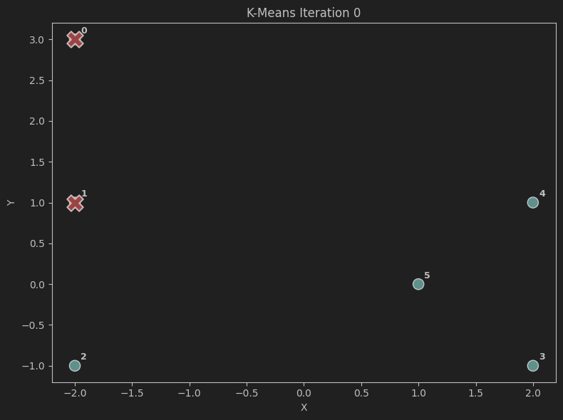
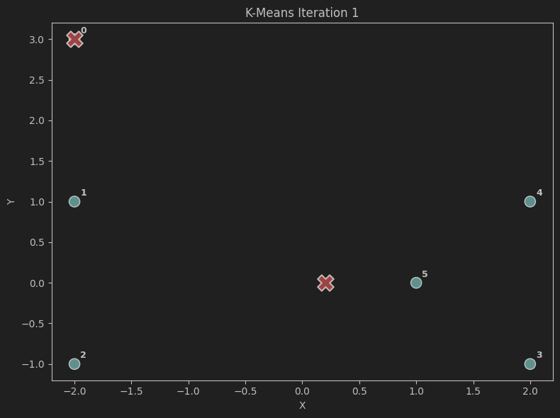

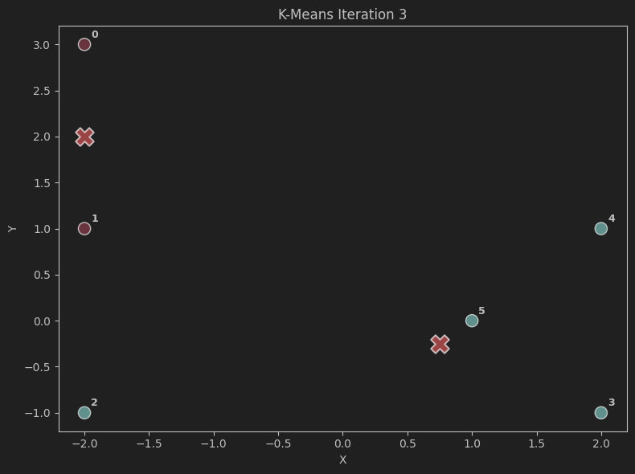
### Centroïdes initiaux $M_4$ et $M_6$
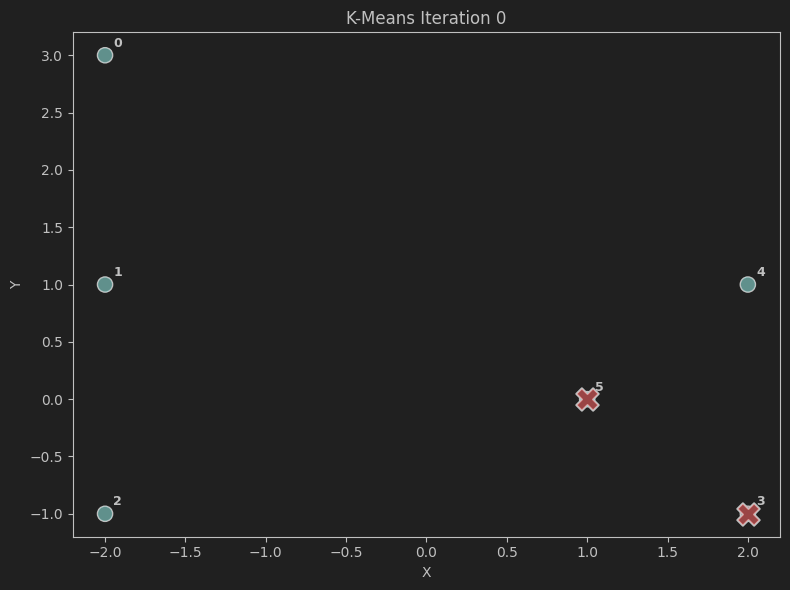
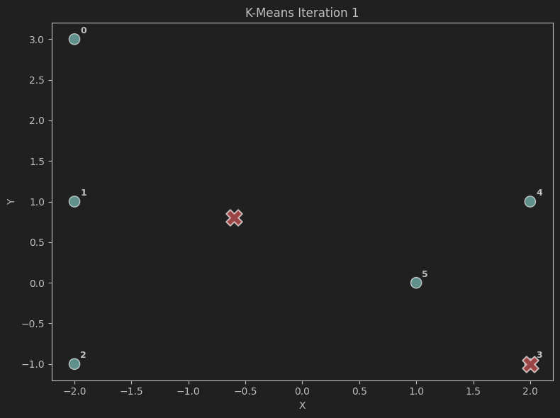

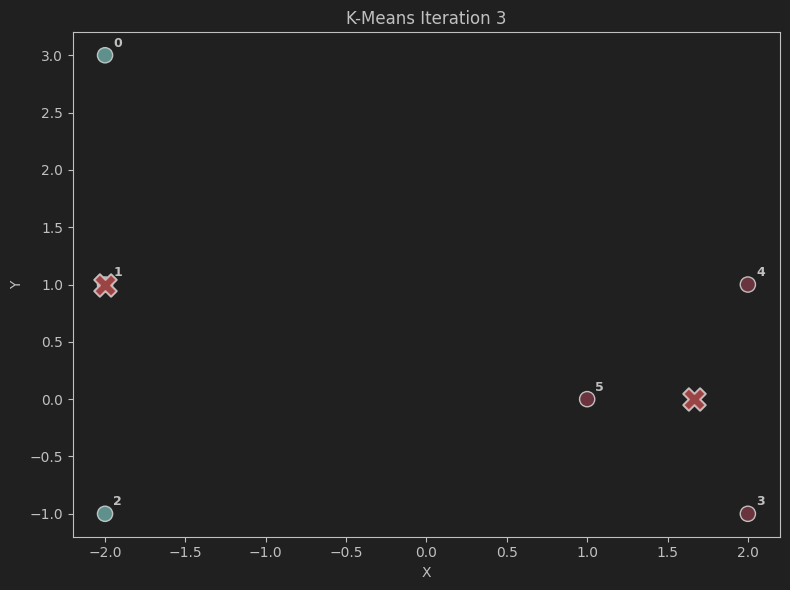

## 4) Avec sklearn

Le code proposé dans le sujet permet d'obtenir les résultats suivants pour le dataset 14 :

- [0 1 2 2 2]
- [0 0 1 1 2]

>On devine que l'algo de `sklearn` renvoie une liste contenant le numéro de cluster de chaque point.

# II. Clustering hiérarchique
cf notebook associé

# III. Étude de cas

## Préparation des données

On étudie le dataset `country-data` qui contient 9 attributs de 167 pays.

En premier lieu on peut visualiser la distribution de chaque attribut : 

On remarque que celles-ci ont des formes similaires, normales, log-normales ou bi-modales, des 
cas classiques en analyse de données.

En revanche, les données deviennent très différentes dès lors que l'on analyse des paramètres 
plus précis _(intervalles de valeurs, écart-types, moyennes, médianes ...)_

On applique alors une PCA pour faciliter l'interprétation et la visualisation des données.

- Les variables initiales, corrélées et de natures différentes, sont donc transformées en un 
  nouveau jeu de variables non corrélées appelées __composantes principales__.
- Avant cette transformation, les données sont normalisées pour éviter qu’une variable à grande échelle domine les autres.

## Génération des figures

Maintenant que l'on a un jeu de données centré, réduit, et avec seulement deux dimensions, on peut générer des visualisations. De la même manière que dans les exercices précédents, on va donc générer :
- Deux visualisations de clustering k-means , avec respectivement `k=2`et `k=3`
- Deux visualisations de clustering hiérarchique, pour single link et complete link

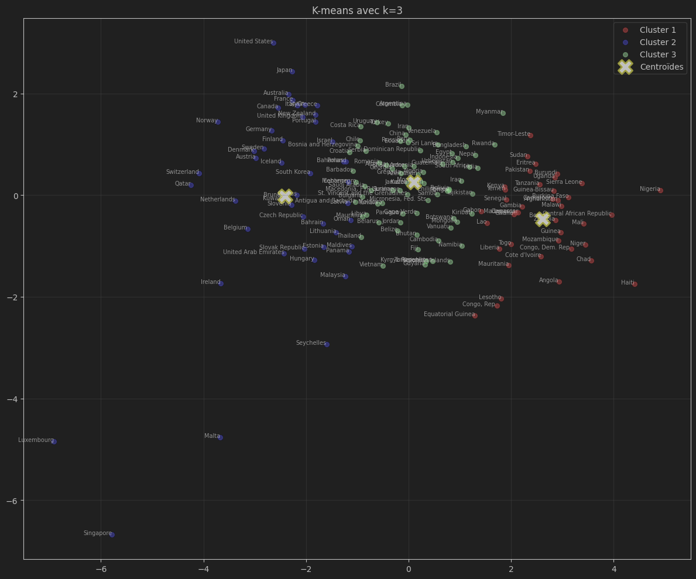
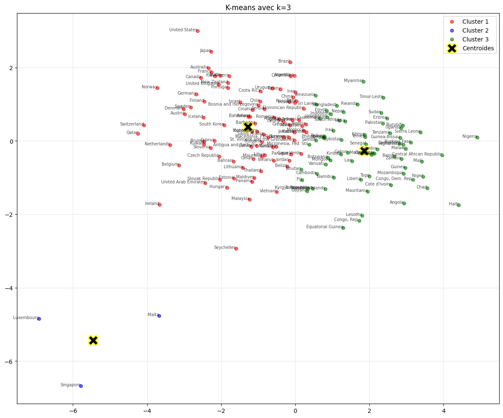
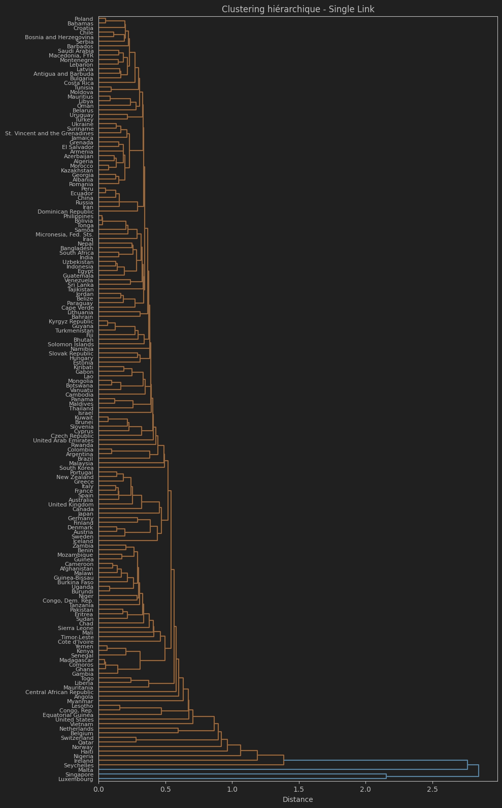
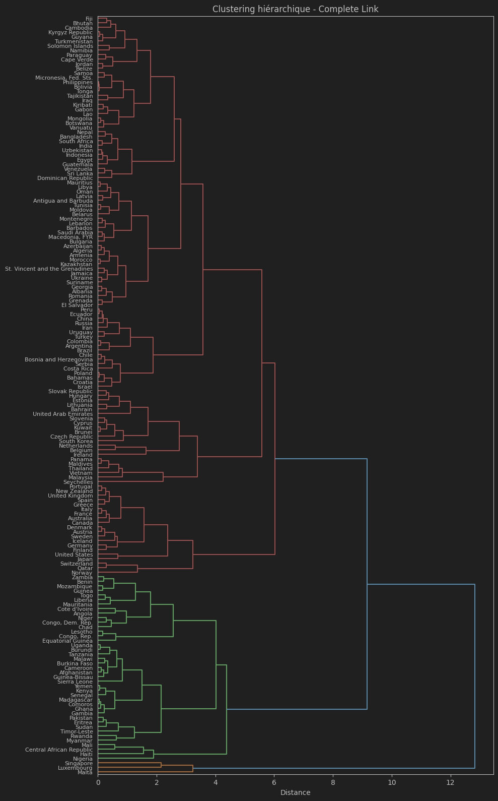